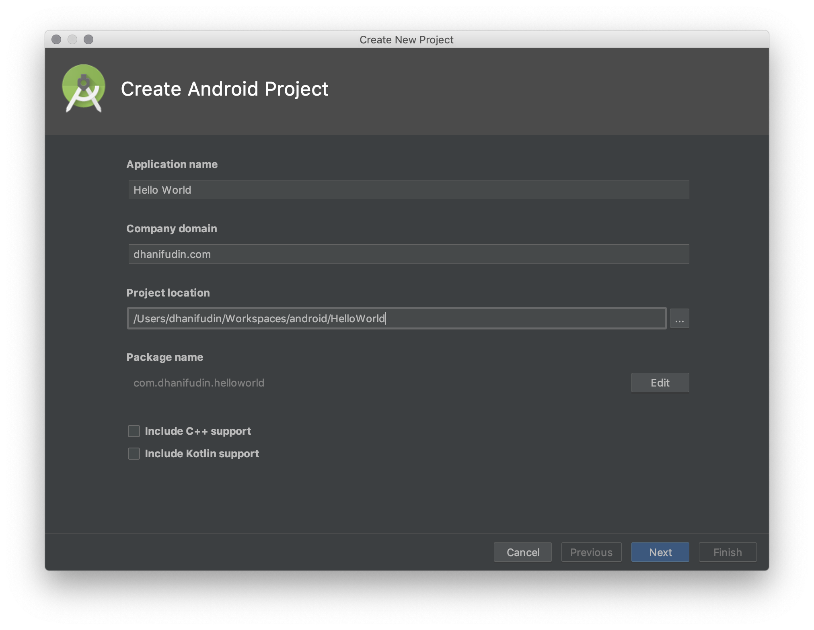
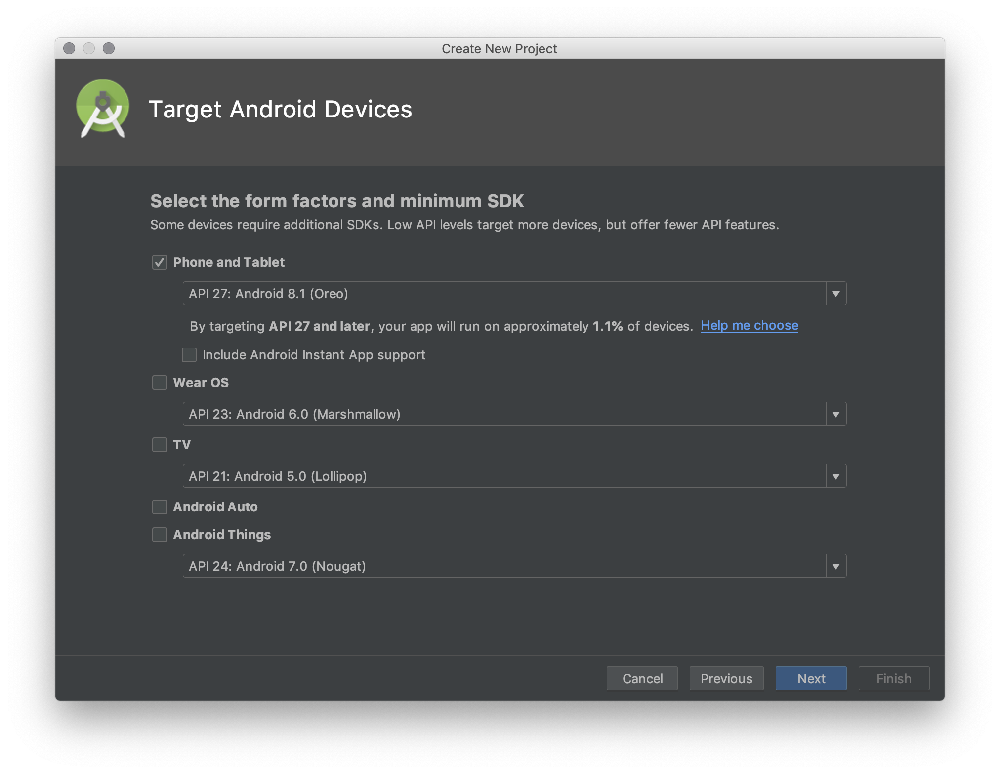
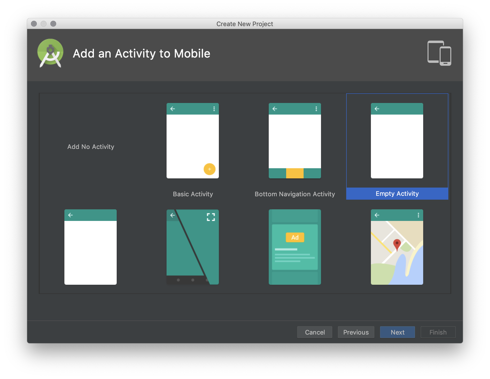
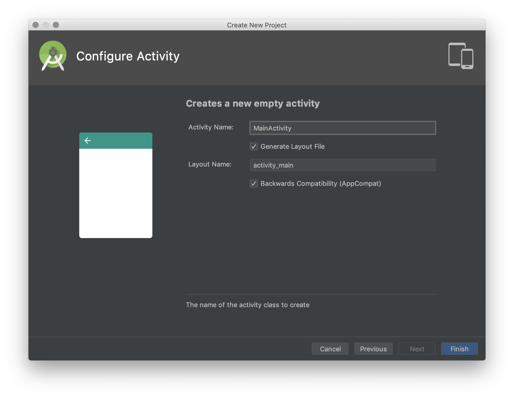

# Tugas Praktikum 01

- Install Android Studio dan Android SDK
- Buatlah sebuah project android untuk menampilkan pesan seperti pada gambar berikut:

  

- Tampilkan pesan Hello World diikuti dengan identitas nama anda!

# Catatan

- Untuk membuat project baru android ikuti langkah-langkah berikut
- Pilih **Start a new Android Studio Project**
- Masukkan informasi **Application name** (Contoh: Hello World)
- Pada informasi company domain, tuliskan identifier nama pembuat project
  android, umumnya juga berupa alamat domain pembuat aplikasi (dalam contoh ini
  adalah `dhanifudin.com`)
- Pilih tempat penyimpanan lokasi project, ke dalam hasil clone repo assignment
 anda!

  

- Kemudian tekan tombol **Next**
- Pada dialog berikutnya, berisi informasi tentang Target Android Devices.
- Sesuaikan dengan versi SDK yang terinstall pada PC/Laptop anda.

  

- Kemudian tekan tombol **Next**
- Pada dialog ini, pilih **Empty Activity** kemudian tekan tombol **Next**

  

- Untuk dialog terakhir, tekan tombol **Finish**

  
